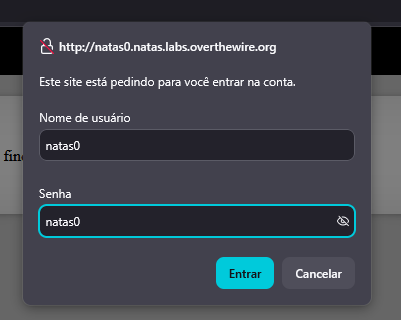
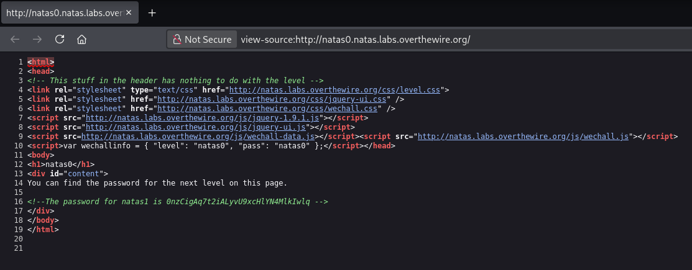

# Natas

## A Natas ensina o básico da segurança na web do lado do servidor.

Cada nível de natas consiste em seu próprio site localizado em http://natasX.natas.labs.overthewire.org, onde X é o nível número. Não há login SSH. Para acessar um nível, insira o nome de usuário para esse nível (por exemplo, natas0 para o nível 0) e sua senha.

Cada nível tem acesso à senha do próximo nível. O teu trabalho é de alguma forma obter essa próxima senha e subir de nível. Todas as senhas também são armazenado em /etc/natas_webpass/. Por exemplo, a senha do natas5 é armazenada no arquivo /etc/natas_webpass/natas5 e apenas legível por natas4 e natas5.

Comece aqui:

Username: natas0
Password: natas0
URL:      http://natas0.natas.labs.overthewire.org

Ferramentas que você pode achar úteis para resolver este jogo de guerra

Um navegador de webbrowser, curl, proxy ZAP

## ìndice

- [Level 0](#Level-0)

### Level 0

Username: natas0
Password: natas0
URL:      http://natas0.natas.labs.overthewire.org

---

### Level 1

A senha pode ser visualizada no código fonte da página, utilizando a opção `View Page Source`.

senha: 0nzCigAq7t2iALyvU9xcHlYN4MlkIwlq 

---
